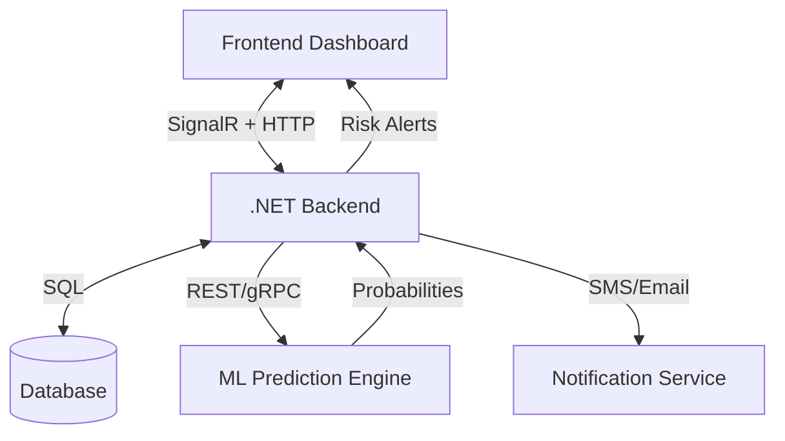

# NoShowIQ Architecture & Pipeline

## 1. System Architecture
NoShowIQ follows a **Clean Architecture** approach with a **Real-Time** event-driven backbone.

### Core Components
1.  **Frontend (Dashboard)**
    *   **Tech**: Next.js (React) + TailwindCSS
    *   **Role**: Visualizes appt flow, shows real-time risk scores, allows manual overrides.
2.  **Backend (API Gateway & Core Logic)**
    *   **Tech**: .NET 8 Web API
    *   **Role**: Manages bookings, auth, orchestrates ML predictions, handles business logic.
3.  **ML Engine (The Brain)**
    *   **Tech**: Python (FastAPI + Scikit-Learn/XGBoost) OR ML.NET
    *   **Role**: Receives appointment features, returns No-Show Probability (0-100%).
4.  **Real-Time Layer**
    *   **Tech**: SignalR (WebSockets)
    *   **Role**: Pushes live updates to the dashboard (e.g., "High Risk No-Show Detected").
5.  **Database**
    *   **Tech**: PostgreSQL / SQL Server
    *   **Role**: Stores patient history, appointments, and prediction logs.

### High-Level Diagram

## 2. ML + Real-Time Pipeline

### The Trigger
1.  **New Appointment** or **Modification** occurs in the system.
2.  **Event Firing**: `AppointmentScheduled` event is published.

### The ML Pipeline
1.  **Feature Extraction**:
    *   *Patient History*: No-show rate, days since last visit.
    *   *Demographics*: Age, distance from clinic (zip code).
    *   *Appointment Details*: Time of day, day of week, lead time (days booked in advance).
    *   *Weather/Traffic* (Optional external factors).
2.  **Inference**:
    *   Data sent to ML Model.
    *   Model calculates `RiskScore` (e.g., 0.85 = 85% chance of no-show).
3.  **Decision Engine**:
    *   **Low Risk (<20%)**: Standard reminder flow.
    *   **Medium Risk (20-60%)**: Enhanced reminders (SMS + Email).
    *   **High Risk (>60%)**:
        *   Flag for manual call.
        *   **Smart Overbooking**: Suggest opening a "double book" slot for this time.

### Real-Time Feedback Loop
1.  API receives `RiskScore`.
2.  **SignalR** pushes alert to Clinic Dashboard: *"⚠️ High Risk: John Doe (Tues 9 AM)"*.
3.  Staff sees "Recommended Action: Overbook Slot".
